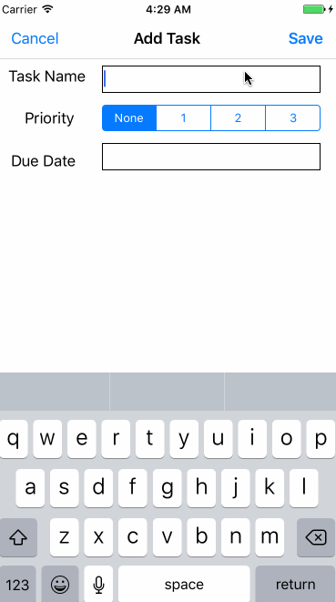

# Real Tasks
A simple to do app created in Swift 3.1 using Realm Mobile Database  
Time Spent: 11 hours  

## Features
- [x] Create tasks with priority and date
- [x] Edit tasks  
- [x] Delete tasks  
- [x] Priority Levels
- [x] Search
- [x] Sort by priority
- [x] Sort by date

## Issues
- Reordering tasks does not work. This means any editing or deleting of actions after sorting or searching may result in incorrect details being shown.

## Video Walkthrough 

Here's a walkthrough of implemented user stories:

<!-- 
 -->
GIF created with [LiceCap](http://www.cockos.com/licecap/).

## Notes

Describe any challenges encountered while building the app.

## License

    Copyright [2017] [Sean Sangwoo Nam]

    Licensed under the Apache License, Version 2.0 (the "License");
    you may not use this file except in compliance with the License.
    You may obtain a copy of the License at

        http://www.apache.org/licenses/LICENSE-2.0

    Unless required by applicable law or agreed to in writing, software
    distributed under the License is distributed on an "AS IS" BASIS,
    WITHOUT WARRANTIES OR CONDITIONS OF ANY KIND, either express or implied.
    See the License for the specific language governing permissions and
    limitations under the License.
